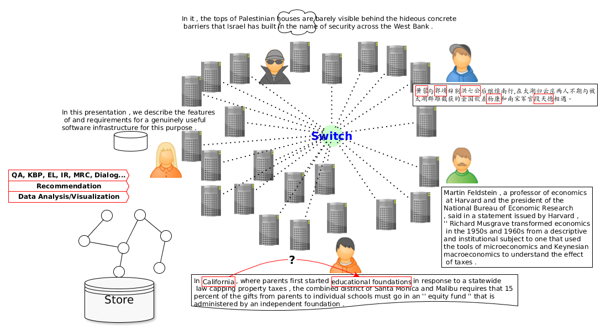

## SwitchNet ([Project Tutorial](https://nnntt.github.io/SwitchNet/))
#### As long as this paper is accepted, this project is publicly available. 

[](https://opensource.org/licenses/Apache-2.0)

SwitchNet is a framework to accelerate relation extraction and lifelong learning research. Adaptively continuously learn and extract different forms and new classes of relations. It is a preview. The detailed descriptions are still in the making.  
<span></span>  
### Contents

* [Basics](#basics)
  * [Installation](#installation)
  * [Addition](#addition)
    * [Distant supervision](#distant-supervision)
    * [Elastic weight consolidation (for lifelong learning)](#elastic-weight-consolidation)
     * [Conditional random field](#conditional-random-field)
    * [Model visualization](#model-visualization)
    * [Data visualization analysis](#data-visualization-analysis)
    * [Object detection papers](#object-detection-papers)
* [Citation](#citation) 
* [Updating](#updating)

<span></span>  
Figure 1. Neural architecture overview   

## Basics

<span></span>  
Figure 2. Lifelong relation extraction  

#### Object detection papers
Get more inspiration or evolution from papers for object detection or face detection recognition.  
```
@inproceedings{girshick2014rich,
  title={Rich feature hierarchies for accurate object detection and semantic segmentation},
  author={Girshick, Ross and Donahue, Jeff and Darrell, Trevor and Malik, Jitendra},
  booktitle={Proceedings of the IEEE conference on computer vision and pattern recognition},
  pages={580--587},
  year={2014}
}
@inproceedings{girshick2015fast,
  title={Fast r-cnn},
  author={Girshick, Ross},
  booktitle={Proceedings of the IEEE international conference on computer vision},
  pages={1440--1448},
  year={2015}
}
@inproceedings{ren2015faster,
  title={Faster r-cnn: Towards real-time object detection with region proposal networks},
  author={Ren, Shaoqing and He, Kaiming and Girshick, Ross and Sun, Jian},
  booktitle={Advances in neural information processing systems},
  pages={91--99},
  year={2015}
}
@inproceedings{redmon2016you,
  title={You only look once: Unified, real-time object detection},
  author={Redmon, Joseph and Divvala, Santosh and Girshick, Ross and Farhadi, Ali},
  booktitle={Proceedings of the IEEE conference on computer vision and pattern recognition},
  pages={779--788},
  year={2016}
}
```
Papers about face detection.
```
@inproceedings{schroff2015facenet,
  title={Facenet: A unified embedding for face recognition and clustering},
  author={Schroff, Florian and Kalenichenko, Dmitry and Philbin, James},
  booktitle={Proceedings of the IEEE conference on computer vision and pattern recognition},
  pages={815--823},
  year={2015}
}
@article{viola2001rapid,
  title={Rapid object detection using a boosted cascade of simple features},
  author={Viola, Paul and Jones, Michael and others},
  journal={CVPR (1)},
  volume={1},
  number={511-518},
  pages={3},
  year={2001}
}
@article{viola2004robust,
  title={Robust real-time face detection},
  author={Viola, Paul and Jones, Michael J},
  journal={International journal of computer vision},
  volume={57},
  number={2},
  pages={137--154},
  year={2004},
  publisher={Springer}
}
```
## Updating...
* 2019-Oct-15, SwitchNet v0.3.2, introduce EOIs and POEOIs and establish a direct link between relation extraction and computer vision studies
* 2019-Aug-15, SwitchNet v0.3.1, introduce ranking mechanism for candidate selection
* 2019-Aug-10, SwitchNet v0.3.0, expand RPI to RPI-PE by adding position embedding, widely compatible with SRE/MRE models for triple extraction
* 2019-Apr-20, SwitchNet v0.2.1, enhance modularity by switching information flow based on input data  
* 2019-Mar-03, SwitchNet v0.2.0, support visualization for interpretability  
* 2019-Jan-20, SwitchNet v0.1, initial version, build a new framework, SwitchNet, for lifelong relation extraction, compatible with pre-trained BERT  